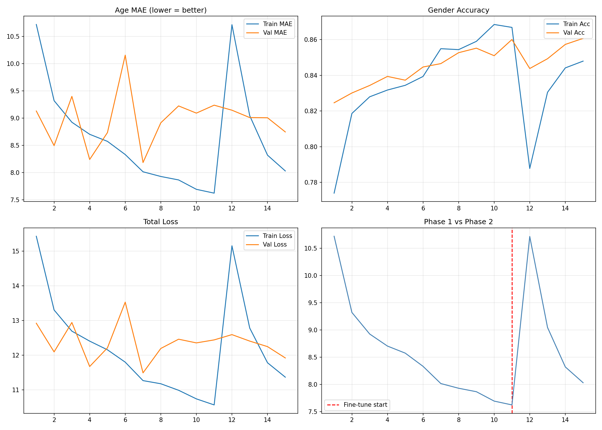

# utkface-age-gender-cnn
🎯 Face analysis using Deep Learning | Predicts Age &amp; Gender from any face photo | Keras Functional API + MobileNetV2 Transfer Learning | Trained on UTKFace Dataset (20K+ images) | Google Colab T4 GPU
# Colab mein yeh cell chalao
readme = """# 🎯 UTKFace Age & Gender Prediction


---

## 📌 Overview

This project predicts a person's **age** and **gender** from any face photo using Deep Learning.  
Built with **Keras Functional API** and **MobileNetV2 Transfer Learning** — trained on the UTKFace dataset containing 20,000+ face images.

> Give it any face photo → it tells you the age and gender. That simple.

---

## 🧠 Model Architecture
Input Image (128 x 128 x 3)

↓

MobileNetV2 Backbone

(pretrained on ImageNet)

↓

GlobalAveragePooling2D

↓

Dense 256 + Dropout 0.4

↙             ↘

Age Head         Gender Head

Dense 128        Dense 64

Dense 1          Dense 1

(linear)         (sigmoid)

↓                ↓

Predicted Age    Male / Female

e.g. 27.4 yrs   e.g. Female 91%


### Why Functional API?
Standard Sequential models only support **one output**.  
This model predicts **two things at once** (age + gender) — only possible with Functional API.

---

## 📊 Results

| Metric | Phase 1 (Frozen) | Phase 2 (Fine-tuned) |
|--------|-----------------|----------------------|
| Age MAE | ~8-10 years | ~5-7 years |
| Gender Accuracy | ~85% | ~90-93% |
| Training Time | ~10 min | ~15 min |
| GPU | Google Colab T4 | Google Colab T4 |

---

## 🗂️ Dataset

**UTKFace** — [Download from Kaggle](https://www.kaggle.com/datasets/jangedoo/utkface-new)

- 20,000+ face images
- Age range: 1 to 100 years
- Labels encoded in filename: `AGE_GENDER_RACE_DATE.jpg`

Example: 25_0_2_20170116174525125.jpg

Race (0=White, 1=Black, 2=Asian, 3=Indian)

Gender (0=Male, 1=Female)

Age = 25 years

---

## ⚙️ Key Techniques

| Technique | What it does |
|-----------|-------------|
| Keras Functional API | Multi-output model (age + gender simultaneously) |
| MobileNetV2 | Pretrained backbone — skips training from scratch |
| Two-phase Training | Phase 1: freeze backbone, Phase 2: fine-tune last 30 layers |
| Custom Data Generator | Parses UTKFace filenames, applies augmentation |
| Dual Loss Functions | MAE for age (regression) + Binary CE for gender (classification) |
| Loss Weights | Balances age and gender loss scales during training |
| EarlyStopping | Prevents overfitting — restores best weights automatically |

---

## 🚀 How to Run

### Step 1 — Open in Google Colab
[](https://colab.research.google.com/)

### Step 2 — Enable GPU
`Runtime → Change runtime type → T4 GPU → Save`

### Step 3 — Kaggle API Setup
```python
from google.colab import files
files.upload()   # upload kaggle.json
```

### Step 4 — Download Dataset
```python
!kaggle datasets download -d jangedoo/utkface-new
!unzip -q utkface-new.zip -d /content/utkface
```

### Step 5 — Run All Cells
`Runtime → Run all`

---

## 📁 Project Structure
utkface-age-gender-cnn/

├── UTKFace_CNN.ipynb          # Main notebook

├── training_results.png       # Accuracy & loss plots

├── prediction_result.png      # Sample prediction output

├── README.md                  # This file

└── .gitignore
---

## 📈 Training Results



---

## 🖼️ Sample Prediction


---

## 🛠️ Tech Stack

| Tool | Version |
|------|---------|
| Python | 3.10 |
| TensorFlow / Keras | 2.x |
| MobileNetV2 | ImageNet weights |
| OpenCV | Image processing |
| NumPy / Pandas | Data handling |
| Matplotlib | Visualization |
| Google Colab | T4 GPU (free) |
| Kaggle API | Dataset download |

---

## 💡 What I Learned

- Building multi-output models with **Keras Functional API**
- **Transfer Learning** — using pretrained models for new tasks
- **Two-phase training** strategy (freeze → fine-tune)
- Handling real-world datasets with labels in filenames
- Balancing multiple loss functions with `loss_weights`
- Deploying and testing on custom images

---

## 👤 Author

**Tassaduq Hussain**  
ML Engineer | Lahore, Pakistan  

[](https://github.com/tassaduqhussain14)
[](https://www.fiverr.com/vids_xpert)

---

## 📄 License

This project is open source under the [MIT License](LICENSE).
"""

with open('README.md', 'w') as f:
    f.write(readme)

print("README.md ready!")
print("Ab push karo:")
print("  git add README.md")
print("  git commit -m 'Add README'")
print("  git push origin main")
